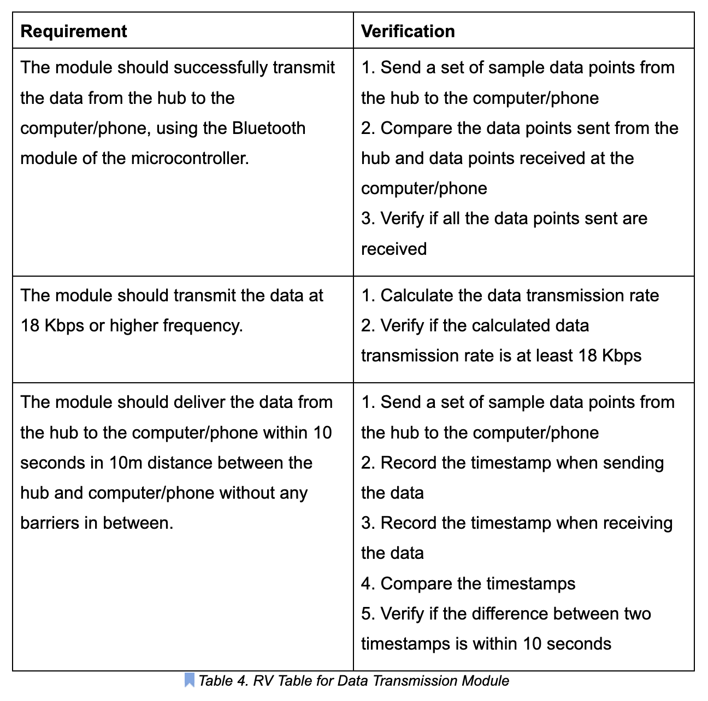
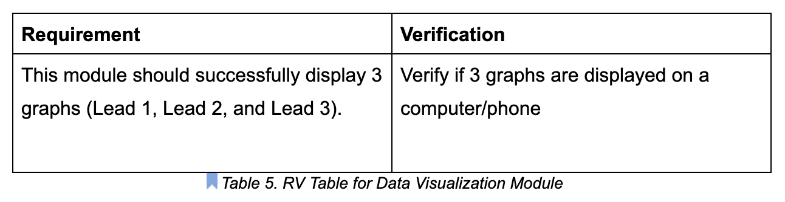
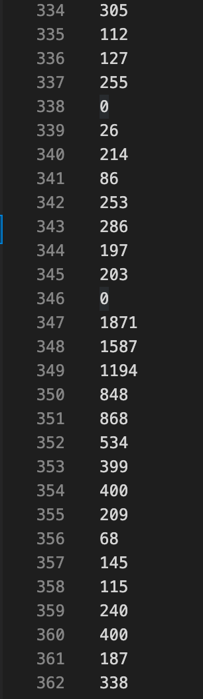
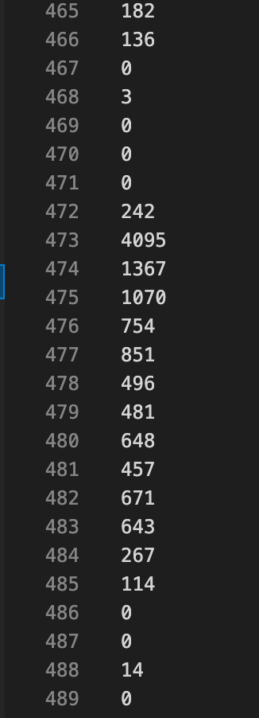
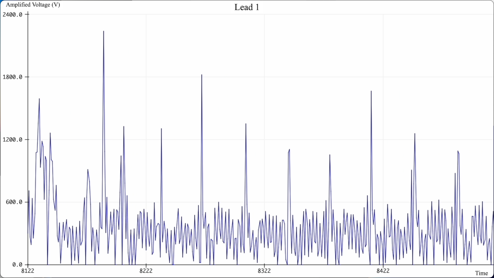
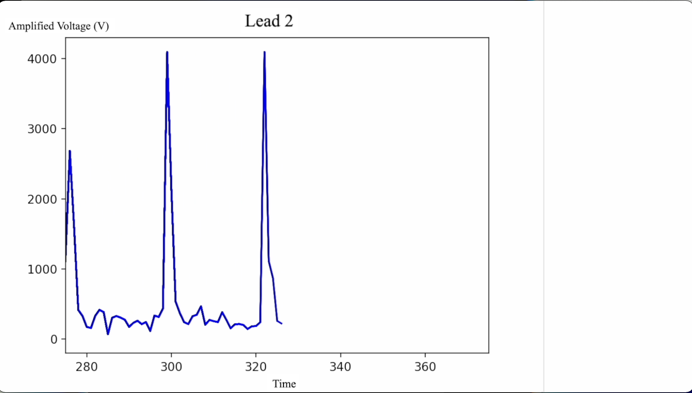
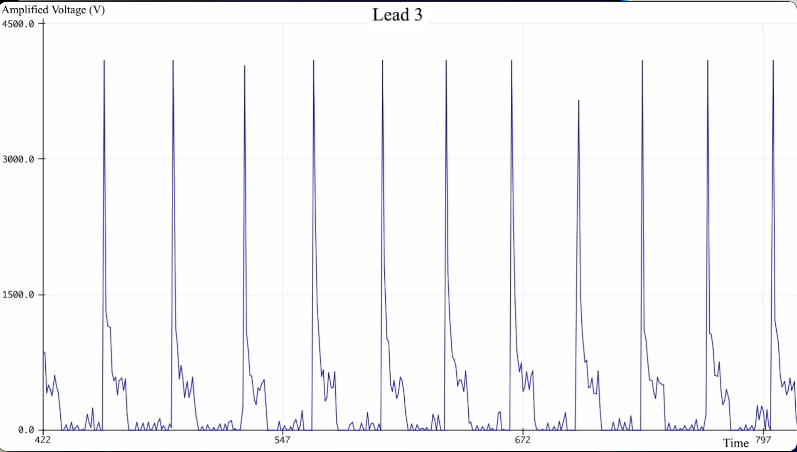

# Week 4 (2/7/2022 – 2/13/2022)
### 2/7/2022 (Mon)

#### \<Meeting Notes\>
<Proposals>

1. Divide up parts
<br>

2. Make decision on 
    - Bulb vs. Tiny patch
    - which microprocessor we’re gonna use?
    - Power supply:
        - non-rechargeable vs. rechargeable
            —> non-rechargeable due to time limit
    - What are we actually measuring?
        - body surface potential mapping
        - electrical potential gradient
    - Wireless transmission
        - bluetooth or what?
    - Data visualization
    - Filtering process
        - both at actual measurement and data visualization part (or one of them)
<br>

3. Components
	- Functioning Body —> what are we gonna use?
		- needs to hold our PCB and power supply
		- needs to stay on the body skin
	- Wireless transmission module
		- transmits data from the functioning body to the computer / screen
		- global clock
	- Power supply
		- what are we gonna use?
		- what voltage is enough? And why?
	- EKG board
	- Data Processing and visualization
		- unit should be small enough
<br>

4. Data processing and visualization
	- graph: voltage vs. time

Choose a microcontroller chip with integrated wi-fi and dual-mode bluetooth

Wireless sensor networks (WSN)

Wireless body electrode (WBE) must be ultra low power

A/D converter, filtered with RF, amplified, filtered with a band-pass filter 


<br>

# Week 5 (2/14/2022 – 2/20/2022)
### 2/16/2022 (Wed)
We sent an email to our project sponsor Kenny regarding our inquiries of the project and the design in general. 
After receiving Kenny's reply, we finalized on some of the aspects of the design:
1. Kenny presented a paper explaining that a separate ground plane can poetentially be unnecessary, but does have higher noise than if we had one. In the scope of our project, we decided to include the ground plane in order to eliminate potential noise issues. 
2. Our design will include three patches and a hub. One patch for the reference ground plane and the other two for the positive terminal of the voltage measurement. The hub will contain all the voltage processing, analog to digital conversion, and wireless transmission. 
3. We plan to replace the previous suction system by using clipping ECG patches, which enhances replaceability.
4. Retractable wires will be used in order to eliminate potential wire issues. 

<br>

### 2/17/2022 (Thur)
#### \<Weekly meeting with TA Notes\>
#### Logistics
- Better to finish the design document draft before Design Document Check
- Proposal should be graded by this weekend.
- Anything related to PCB -> go talk to the TA, Evan


#### Design Document
1. Have the high level requirements be perfect
2. More feedback during the design document check
3. Verification for every subsystem —> talked about it during lectures
4. Self-explanatory
5. Visual aid: zoom it and provide more details
6. You can definitely change the products you use later, but make sure that the verifications and requirements are stable.
7. Be consistent with the format, spacing, and citation (IEEE), etc.
8. Make sure to cite the last semester’s project
9. Grading is pretty harsh.

<br>

<!-- <div style="page-break-after: always"></div> -->

# Week 6 (2/21/2022 – 2/27/2022)
### 2/21/2022 (Mon)

Data Transmission Module
* Requirements
    1. Successfully transfer the data to the data visualization module
    2. Calcuate the minimum required transmission rate. Ensure the product is at least that transmission rate.

Data Visualization Module
* Requirements
    1. Display three graphs, each graph representing the data of each lead.

<br>

### 2/22/2022 (Tue)
#### DESIGN DOCUMENT CHECK
#### \<General Feedback\>
#### Tolerance analysis
1. The most important point in our project
2. How modifications will change the results
3. Specific component, not a module
4. Equations should be in separate lines from text

#### Requirement and Verification
1. Lines start in the same page

#### Block diagram
1. You don’t put specific chips on block diagram


#### \<Our Design Document Feeback\>
#### High-level Requirements
1. Add tolerance
	- what if cut off freq is not within the bound
	- if 200Hz is coming from somewhere, put citation (like [3])

#### Block diagram
1. Some of the lines are hard to distinguish
    - e.g., between power and ground 
2. Show what’s 3.3V and 5V
3. Label transmission as bluetooth
4. Data
    - analog or digital ? —> label them
    - if have different data protocols
5. No need to label all the ground
6. Lines a bit confusing
    - from the top
7. Arrow between 9b and 5.5
    - invisible (too small)


#### Requirement and Verification
1. The number —> is it coming from the datasheet?
    - double check that it’s not from data sheet —> no need to verify if it’s from data sheet
    - amplified correctly?
        - where is it coming from
        - maybe combine with the next one

2. Add some tolerances in these so you have rooms
3. Table capture ???


#### Tolerance analysis	
1. Put more equations
    - how you actually calculated the values you’re using
2. ADC
    - from data sheet ?
        - if so, cite it
3. Do some analysis with the frequencies


<br>

### 2/24/2022 (Thur)
#### \<Weekly meeting with TA Notes\>

1. Data transmission subsystem calculation (in the desing document) looks fine.
    - You can incorporate that with Tolerance Analysis (if you want)
    - That is something instructors/graders expect to see in Tolerance Analysis

2. Design Review is a formal presentation
    - Be on time
    - Be professional
    - etc.

3. Cite everything in the design document
    - IEEE format
    
<br>
Final R & V for Data Transmission Module for Design Document 1



    
<br>
Final R & V for Data Visualization Module for Design Document 1




<div style="page-break-after: always"></div>

# Week 7 (2/28/2022 – 3/6/2022)
### 3/1/2022 (Tue)
Design Review is done.

<br>

### 3/4/2022 (Fri)
Options of visualization:
    Mobile app, Website, Python, MATLAB

<br>

<div style="page-break-after: always"></div>

# Week 8 (3/7/2022 – 3/13/2022)
### 3/7/2022 (Mon)
First Round PCB Order: Reviewed
- Decided to use ESP32-D0WD because the data sheet of ESP32-WROOM says this model is not recommended for a new design.

<br>

<div style="page-break-after: always"></div>

# Week 9 (3/14/2022 – 3/20/2022)
### SPRING BREAK
<br>

<div style="page-break-after: always"></div>

# Week 10 (3/21/2022 – 3/27/2022)
### 3/23/2022 (Wed)

Received ESP32

Started unit testing with ESP32

<br>

### 3/27/2022 (Sun)
Testing ESP32 with sample codes:

1. Compile ->  successful

2. Upload -> succesful
	- hold the boot button down when uploading

3. Code not working
	- LED sample code working
    - Bluetooth sample code not working as expected

<br>
<br>

<div style="page-break-after: always"></div>

# Week 11 (3/28/2022 – 4/3/2022)

Week 11 is for to keep working on ESP32 testing and start finalizing the visualization method.

<br>
One of the sample codes used for testing ESP32:

Analog Read Serial:
    
- It reads two analog inputs, each corresponding to Lead 1 and Lead 3 measurement, and display them on the serial monitor.


```Arduino
/*
  Read two analog inputs and display them on the serial monitor
*/

const int out1 = A4; // lead1
const int out2 = A2; // lead2


// the setup routine runs once when you press reset:
void setup() {
  // initialize serial communication at 9600 bits per second:
  Serial.begin(115200);
}

// the loop routine runs over and over again forever:
void loop() {
  // read the input on analog pin 0:
  int sensorValue1 = analogRead(out1);
  delay(5);
  int sensorValue2 = analogRead(out2);
  delay(5);
  // print out the value you read:
  Serial.println(String(sensorValue1));
  Serial.println(String(sensorValue2));
  delay(10);        // delay in between reads for stability
}

```

<br>


<div style="page-break-after: always"></div>

# Week 12 (4/4/2022 – 4/10/2022)

- Decided to create a mobile app that displays the graphs.

- Started working on creating an Android app. The only Android phone our team has is my old phone that I used before. 

- However, with a few days of trying, my phone kept crashing after it connects to the bluetooth module of ESP32 within the app I created. Multiple versions of the app I tried did not work either. 

- As a result, I decided to visualize the graphs on a computer, using Python, instead of an Android mobile app for the sake of time.

<br>

<div style="page-break-after: always"></div>

# Week 13 (4/11/2022 – 4/17/2022)

- Decided to use Bluetooth Low Energy (BLE) module, instead of Bluetooth Classic

- The amount of BLE can handle is sufficient for our project, and it can keep the battery life longer.

- Wrote a Python code for visualizing data

- The following code is for testing drawing graphs only. It does not read the data received through BLE, but rather it plots random numbers.

- The following code will be modified and combined with the receiving data part in the future.


```Python
import time
import psutil
import matplotlib.pyplot as plt
 
%matplotlib notebook
plt.rcParams['animation.html'] = 'jshtml'
 
fig1 = plt.figure()
ax1 = fig1.add_subplot(111)
fig2 = plt.figure()
ax2 = fig2.add_subplot(111)
fig3 = plt.figure()
ax3 = fig3.add_subplot(111)
fig1.show()
 
 
i = 0
x1, y1 = [], []
x2, y2 = [], []
x3, y3 = [], []
 
while True:
   x1.append(i)
   y1.append()  # append Lead 1 datum that is just received
  
   x2.append(i)
   y2.append()  # append Lead 2 datum that is just received
  
   x3.append(i)
   y3.append()  # append Lead 3 datum that is just received
  
   ax1.plot(x1, y1, color='b')
   ax2.plot(x2, y2, color='b')
   ax3.plot(x3, y3, color='b')
  
   fig1.canvas.draw()
   fig2.canvas.draw()
   fig3.canvas.draw()
  
   ax1.set_xlim(left=max(0, i-50), right=i+50)
   ax2.set_xlim(left=max(0, i-50), right=i+50)
   ax3.set_xlim(left=max(0, i-50), right=i+50)
  
  
   time.sleep(0.1)
   i += 1

```


<br>

<div style="page-break-after: always"></div>

# Week 14 (4/18/2022 – 4/24/2022)

In Week 14, there were 3 times when the design of the code changed.

- Windows is required for running the program. For some reasons, Mac could not scan Bluetooth device nearby with the same code that works on Windows.
- Wrote a Python code (getData.py) that finds Bluetooth device nearby.
- Wrote a Python code (test3.py) that connects to the device with a specific address
- test3.py stores the data received in corresponding files depending on which Lead's data it is.

<br>
The following images are the data stored in the files:
<br>
<br>

Lead1:
<br>
<br>



<br>
<br>

Lead3:
<br>
<br>


<br> <br> <br>


The following images are the graphs after improvements:

<br>

Lead1: <br> <br>



<br> <br>
Lead2: <br> <br>



<br> <br>
Lead3: <br> <br>



<br> <br> <br>

<div style="page-break-after: always"></div>

# Week 15 (4/25/2022 – 5/1/2022)

- Demo on April 25 (Mon)

- Gathered clear images and videos of data and graphs to be used for the presentation

- Created slides for the mock presentation

<br>

<div style="page-break-after: always"></div>

# Week 16 (5/2/2022 – 5/5/2022 (Thur))

- Modified the presentation slides for the presentation on May 3 (Tue)

- DONE with the course


